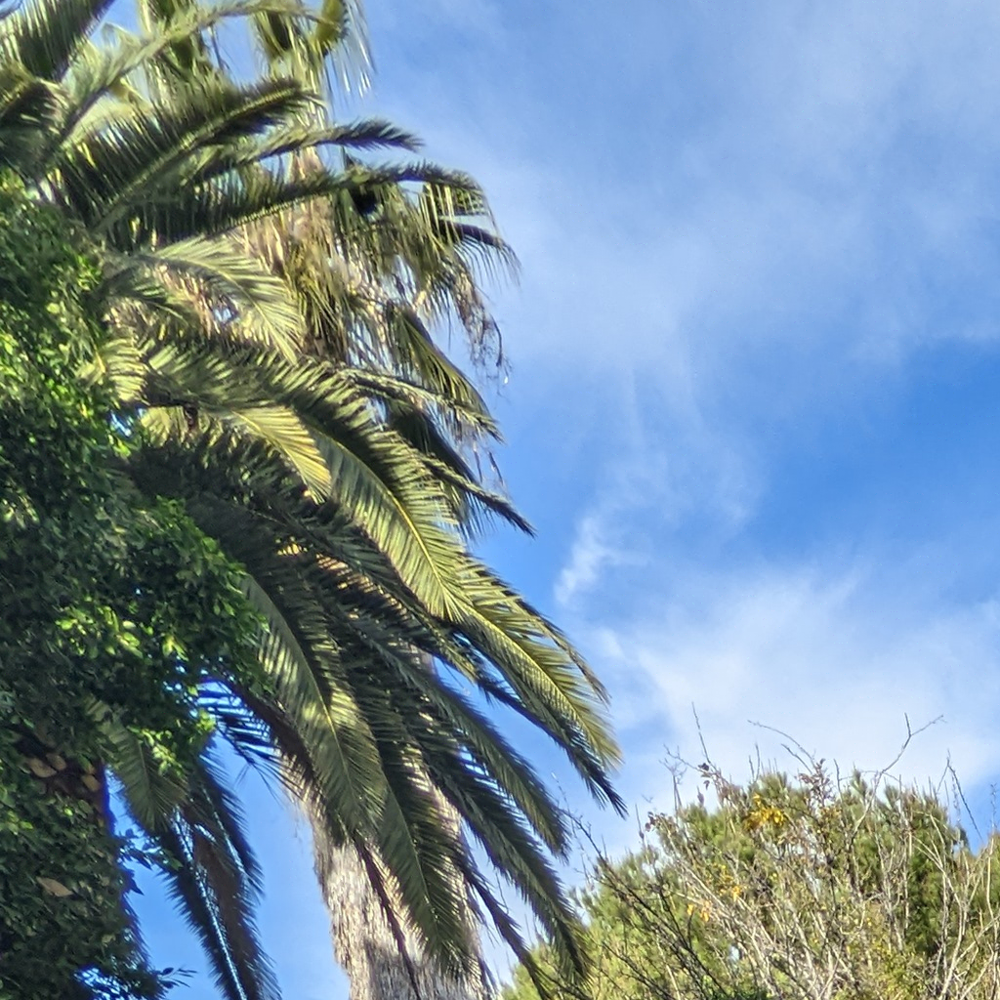
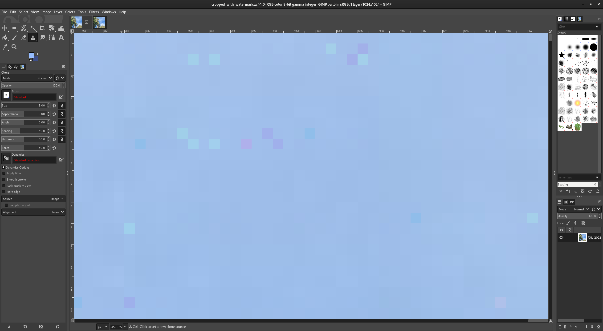

# C-Water: Invisible, Invertible Watermarking #

## Introduction ##

Hyper-realistic but fake images have been a growing concern in recent
years. Digital images are easy to forge, compared with analog
images. Watermarking with cryptographic hashes is one way to prove
that images are authentic. Unfortunately, adding cryptographic
watermark to an image usually makes it impossible to recover the original
image. This project aims to implement a reversible form of
watermarking. We will use fragile watermarks which are easily
destroyed by any compression or transformation of the image. A
non-fragile watermark is not necessary for our use because we are not
concerned here with making sure that the origin of the transformed
image is retained. We are only concerned with authenticating and
recovering an original image.

In addition, we are trying to make the watermark invisible to casual
inspection. This makes it more likely that the watermark will be
preserved. We have implemented C-Water's watermarking, verification,
and image recovery as GIMP plugins.

## Method ##

The watermark we add is a cryprographic hash of the existing image. We
have implemented a 256-bit Blake3 hash, though it would be simple
enough to extend it to any digital signature that is 256 bits or
smaller.

We add a watermark to the image by compressing some bits of the image
and squeezing the hash into the resulting space. If the image to be
watermarked is too small, the plugin will not watermark it, but
will instead pop up an error.

### Discrete Cosine Transform ###

The C-Water plugin divides the image into blocks of 8x8 pixels. GIMP
provides the image data with the channels (e.g. RGB colors)
interlaced. For this iteration, we do not try to separate out
channels. Instead, we treat the whole image as a giant grayscale
image. This turns out to work out well enough for our preliminary
implementation.

Our strategy is to store 2 bits in each 8x8 pixel block. We follow the
lead of [4] by using specific coefficients of the discrete cosine
transform (DCT). 

The DCT is defined as
	 
```math
	G_{lm} = Σ_{ij}(M_{lm\_ij} * g_{ij})
```

where

```math
	M_{lm\_ij} = cos((2i + 1)l \pi/16) cos((2j + 1)m \pi/16)
```
	
and $`g_{ij}`$ is the offset grayscale values.  GIMP provides the values
as $`b_{ij}`$, an unsigned byte from 0 to 255.  We convert to a signed
value by offsetting $`b_{ij}`$.

```math
	g_{ij} = b_{ij} - 128
```

Note that the DCT is not a matrix multiplication, but an element-wise
sum of the product. So

```math
	G_{lm} = (M_{lm\_00} * g_{00}) + (M_{lm\_01} * g_{01}) + (M_{lm\_02} * g_{02}) + ...
```

To store the 2 bits, we modify the coefficient $`G_{66}`$, the (6, 6)
component of the DCT. This component tends to have very little
signal. For example, looking at the quantization matrix for the JPEG
standard, the (6,6) component is one of the most heavily compressed
components of a JPEG image. [1] Because it has very little signal,
it tends to compress well, giving us more space to store our
watermark.

### Modifying Pixels ###

There is one difficulty because we want to modify by pixel
coefficients instead of DCT coefficients. The expression
for $`G_{66}`$ is

```math
	G_{66} = Σ_{ij}(M_{66\_ij} * g_{ij})
```	
	
The structure of the $`M_{66\_ij}`$ matrix is very regular.
   
```math
	M_{66\_ij} = \begin{bmatrix}
		1 - α &      -α &       α &  -1 + α &  -1 + α &       α &      -α &  1 - α \\\
		   -α &   1 + α &  -1 - α &       α &       α &  -1 - α &   1 + α &     -α \\\
		    α &  -1 + α &   1 + α &      -α &      -α &   1 + α &  -1 - α &      α \\\
	   -1 + α &       α &      -α &   1 - α &   1 - α &      -α &       α & -1 + α \\\
	   -1 + α &       α &      -α &   1 - α &   1 - α &      -α &       α & -1 + α \\\
		    α &  -1 + α &   1 + α &      -α &      -α &   1 + α &  -1 - α &      α \\\
		   -α &   1 + α &  -1 - α &       α &       α &  -1 - α &   1 + α &     -α \\\
		1 - α &      -α &       α &  -1 + α &  -1 + α &       α &      -α &  1 - α \\\
	\end{bmatrix}
```

where α = sqrt(2) / 2.

Notice that there are three kinds of terms with magnitudes of 

	* 1 + α
	* α
	* 1 - α

These terms are located in the center, the edge, or the corners of the
4x4 subblock respectively. So we define these components of $`G_{66}`$ as
$`G_{66\_central}`$, $`G_{66\_edge}`$, and $`G_{66\_corner}`$.

```math
	G_{66} = G_{66\_central} + G_{66\_edge} + G_{66\_corner}
```

The $`G_{66\_central}`$ terms are the largest (~1.7071), followed by the
$`G_{66\_edge}`$ terms (~0.7071) and the $`G_{66\_corner}`$ terms
(~0.2928). Therefore, to have the largest effect on $`G_{66}`$, we modify
the $`G_{66\_central}`$ and $`G_{66\_edge}`$ terms.

Looking first at $`G_{66\_central}`$, all the coefficients for $`G_{66\_central}`$
have the same magnitude.  So we can define $`S_{66\_central}`$ as a signed
sum of terms.

```math
	S_{66\_central} ≡ (g_{11} + g_{22} - g_{12} - g_{21})
		            - (g_{15} + g_{26} - g_{16} - g_{25})
				    - (g_{51} + g_{62} - g_{52} - g_{61}) 
					+ (g_{55} + g_{66} - g_{56} - g_{65})
```

And then

```math
	G_{66\_central} = (1 + α) * S_{66\_central}
```

All of the terms that make up $`S_{66\_central}`$ are 8 bit
integers. Therefore $`S_{66\_central}`$ is also an integer. We store the hash
in the third least significant bit of $`S_{66\_central}`$. So if we write
$`S_{66\_central}`$ as a sum of powers of 2,

```math
	S_{66\_central} = s_{1} * 1 + s_{2} * 2 + s_{4} * 4 + s_{8} * 8 + s_{16} * 16 + ...
```

we will use the $`s_{4}`$ term. The lowest bits, $`s_{1}`$ and $`s_{2}`$, turn out
not to compress very well. The original image will have some original
value for $`s_{4}`$ which we will call $`o_{4}`$. After computing our
watermark, we will have a new value $`n_{4}`$.  If $`o_{4}`$ equals $`n_{4}`$, we do
not need to change the image.

### Modifying the DCT ###

If $`o_{4} ≠ n_{4}`$, then we add or subtract to the (1,1), (2,2), (1,2) and
(2,1) values of the original image $`g_{ij}`$.  Specifically, we look at

```math
	S_{mod} = ((S_{66\_central} + 8) % 16) - 8
```
	
This results in a number from -8 to 7. We use the expression because
if $`o_{4}=0`$, then $`S_{mod}`$ will be close to zero. Specifically, it will
be in the range [-4, 3]. If $`o_{4}=1`$, then $`S_mod`$ will be in either the
range [-8,5] or [4,7].  Therefore, we can flip the $`o_{4}`$ bit by adding
or subtracting 4.

For example, if $`o_{4}=0`$ and $`S_{mod}>=0`$, then we can add 4 to
$`S_{central}`$ by:

  * Adding 1 to the (1,1) and (2,2)
  * Subtracting 1 from (1,2) and (2,1)
  
resulting in

```math
	S_{66\_central\_new} = S_{66\_central} + 4
```

The new $`S_{mod\_new}`$ will then be

```math
	S_{mod\_new} = ((S_{66\_central\_new} + 8) % 16) - 8
		      = ((S_{66\_central} + 4 + 8) % 16) - 8
              = S_{mod} + 4
```

To set it to 1, we can then either add 4 if $`S_{mod}`$ >=
0, or subtract 4 if $`S_{mod}`$ < 0.

Suppose that $`S_{mod}`$ >=0.  Then we add 1 to the (1,1) and (2,2) values
of the original image values of $`g_{ij}`$, and subtract 1 from the (1,2)
and (2,1) values of $`g_{ij}`$.  This will mean that

```math
	S_{66\_central\_new} = S_{66\_central} + 4
```

implying that

```math
	S_{mod\_new} = ((S_{66\_central\_new} + 8) % 16) - 8
		         = ((S_{66\_central} + 4 + 8) % 16) - 8
                 = S_{mod} + 4
```

### Invertible, Modular Arithmetic ###

There is one problem.  The image pixels can only have values from 0
to 255.  If we try to add 1 to 255, we overflow the image value. We
work around this by doing all additions mod 16 on the lowest 4
bits. So we get

```math
	g_{ij\_new} = (g_{ij} - (g_{ij} % 16))  + ((g_{ij} ± 1) % 16)
```

If

```math
	g_{11} == 255
```

and we are adding 1, then

```math
    g_{11\_new} = (g_{11} - (g_{11} % 16))  + ((g_{11} + 1) % 16)
                =  255    -  15             + (256        % 16)
                =  240                      + 0
                =  240
```
	
This gives us a procedure for computing new values of $`g_{11}`$, $`g_{12}`$,
$`g_{21}`$, and $`g_{22}`$ such that the $`s_{4}`$ term of $`G{_66\_central\_new}`$
becomes 0 or 1. We follow a similar procedure for $`G_{66\_edge}`$ and the
terms $`g_{01}`$, $`g_{02}`$, $`g_{30}`$, and $`g_{32}`$.

Following this procedure, we have a sequence of bits made up of the
$`s_{4}`$ bits from $`G_{66\_central}`$ and $`G_{66\_edge}`$. This results in 2 bits
per 8x8 block. Following the example of (Fridrich, Goljan, Du etc.),
we compress the bits using JBIG.

We also compute the watermark itself, which is the 256 bit BLAKE3 hash
of all of the pixels of the original image. This sequence of BLAKE3
hash bits and JBIG compressed bits is our new set of bits.

Using the procedure detailed above, we modify the original image to
set the new bits.

#### Limitations####

The BLAKE3 hash is 256 bits, and the JBIG compression routine has a
fixed header of 40 bytes = 320 bits (8 bits per byte => 40 bytes * 8
bits per byte = 320 bits). This means that the smallest possible 3
color image that we could store a watermark in will be

(256 + 320) bits * (8x8 color pixels/block) / (2 bits/block * 3
colors) = 6144 pixels
	  
The actual limit will be larger, since the original bits will not
compress perfectly. However, photos from modern cameras routinely have
millions of pixels, so those pixels should comfortably accomodate the
hash.

### Verification and Recovery###

Using the procedure detailed in the first section, we extract the new
bits $`n_{4}`$ from an image. That gives us both the $`BLAKE\_3`$ hash of the
original image and the compressed bits $`o_{4}`$ of the original image. We
uncompress the compressed bits and use the procedure from the first
section to reset the pixels back to the original values.

Now that we have recovered the original image, we compute the
$`BLAKE\_3`$ hash of the recovered image and make sure that it is the
same as the embedded BLAKE3 hash. This ensures that the image was
watermarked and that we have recovered the original correctly.

If the image is recovered, then we pop up the message: "Image successfully restored."

## Results ##

Here we have the two 1024 x 1024 3 color images, one original picture,
and one with a watermark. It is very difficult to see that it is
watermarked, but it is there and reversible.

Before:


After:



It is very difficult to see the effects of the watermarking on parts
of the image where a lot of pixels are changing. The effect of the
watermark is most evident in regions that are slowly varying with a
flat color. Zooming in on the top right corner, we can see some small
differences.

Before (zoomed):


After (zoomed):



When saving the watermarked image, we have to be careful to save it
with no lossy compression. This can significantly increase the size of
the image.

## Discussion ##

The first issue we encountered was when the watermarking of the pixels
was too visible. This was caused by the overflow in the rgb values. So
changing from addition to addition mod 256 resolved the issue.

The second issue was when the program crashed because the width or
height of the image was not in units of 8 pixels. This was resolved by
setting the program to not watermark the pixels if they do not form in
units of 8x8.

## Future Work ##

Right now, for the $`G_{66\_central}`$ term, we always use the (1,1), (1,2),
(2,1), and (2,2) pixels to store the watermark.  This could lead to a
regularity in the modifications that is more noticeable.  However, there
are 16 possible pixels we could choose for it (e.g. (5,1), (6,5), etc.).
Following [3], we could randomize the selection of pixels by using
bits from the 256 bit Blake3 hash of the image.  Using 4 bits of the
hash we can map uniquely to one of the 16 pixels.  We continue using
successive values of the hash to select 4 pixels, discarding duplicates.
When we run out of bits from the original Blake3 hash, we generate bits
by successively hashing the original hash.

Note that this scheme does not affect how we read the watermark of an
image.  So we can recover the original Blake3 hash in the same
manner. However, it does affect how we restore the original image.
Because we already have the original Blake3 hash, we can use it to
reverse the procedure and recover the original image.

We can use a similar procedure for the $`G_{66\_edge}`$ terms to select from
the 32 possible pixels.

References:

[1] J. Fridrich, M. Goljan and Rui Du, "Invertible authentication watermark for JPEG images," Proceedings International Conference on Information Technology: Coding and Computing, Las Vegas, NV, USA, 2001, pp. 223-227, doi: 10.1109/ITCC.2001.918795. keywords: {Authentication;Watermarking;Digital images;Biomedical imaging;Intelligent systems;Image coding;Transform coding;Quantization;Discrete cosine transforms;Protection},

[2] M. M. Yeung and F. Mintzer, "An invisible watermarking technique for image verification," Proceedings of International Conference on Image Processing, Santa Barbara, CA, USA, 1997, pp. 680-683 vol.2, doi: 10.1109/ICIP.1997.638587. keywords: {Watermarking;Gray-scale;Decoding;Protection},

[3] Jessica Fridrich, Miroslav Goljan, and Rui Du "Invertible authentication", Proc. SPIE 4314, Security and Watermarking of Multimedia Contents III, (1 August 2001); https://doi.org/10.1117/12.435400 

[4] "The Discrete Cosine Transform" Stanford. https://cs.stanford.edu/people/eroberts/courses/soco/projects/data-compression/lossy/jpeg/dct.htm (accessed September 15, 2025)
