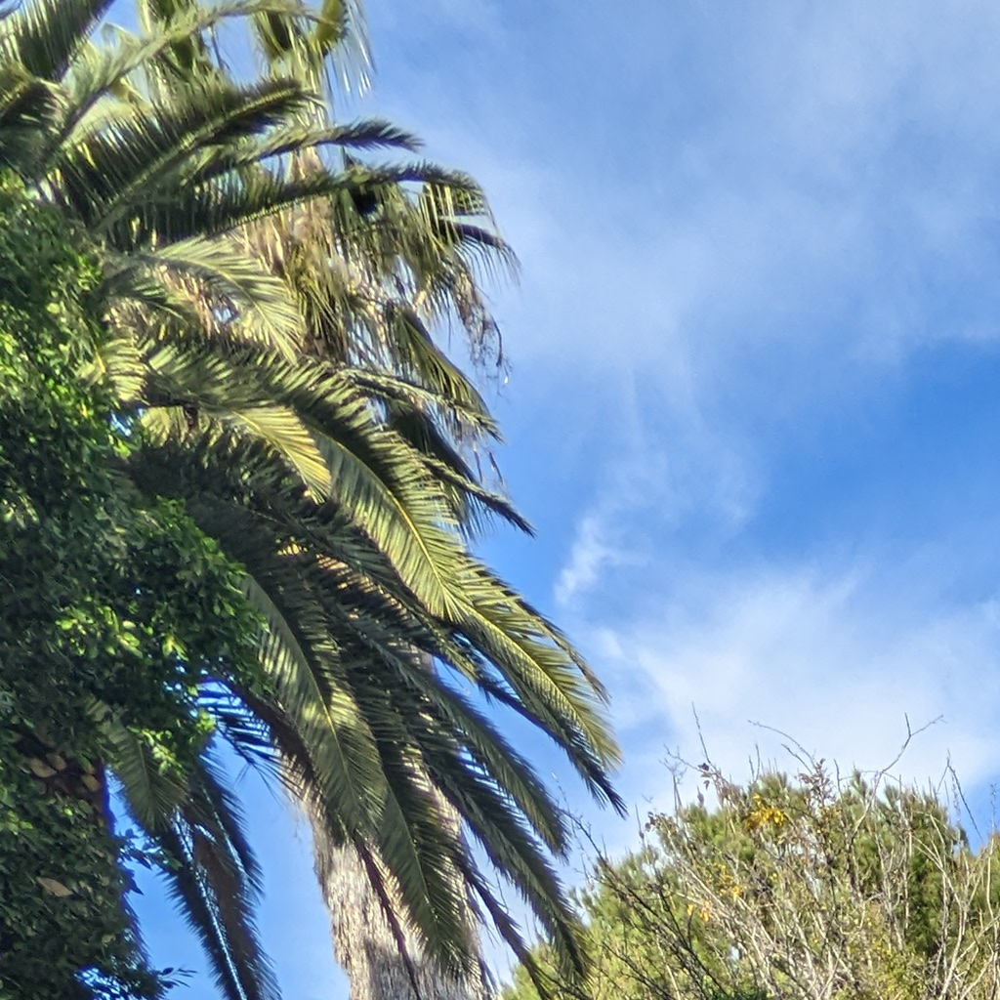
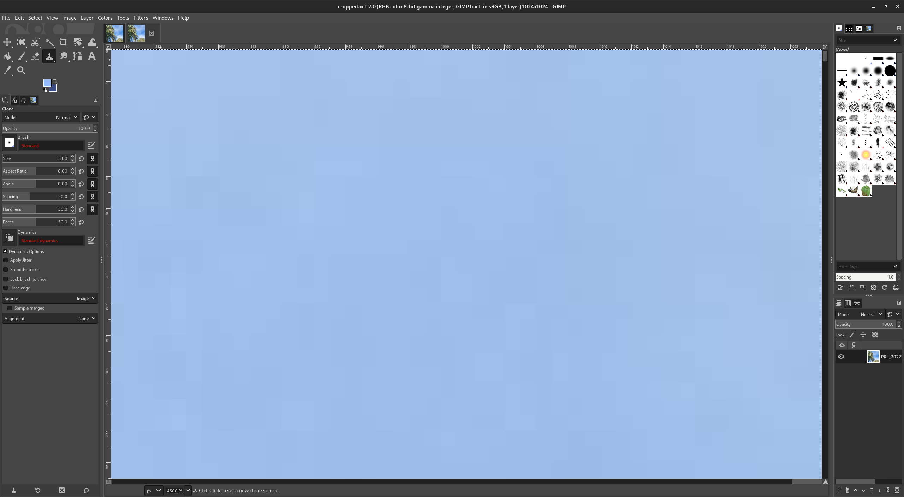
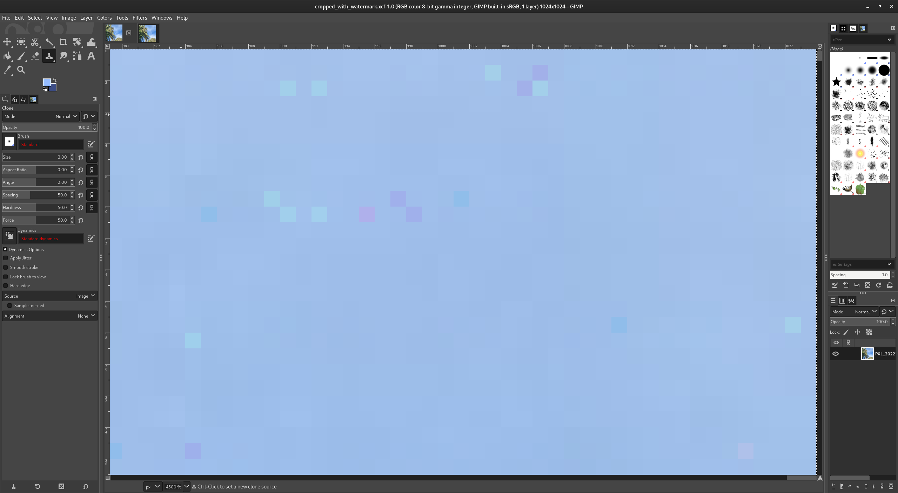

# C-Water: Invisible, Invertible Watermarking #

## Introduction ##

Hyper-realistic but fake images have been a growing concern in recent
years. Digital images are easy to forge, compared with analog
images. Watermarking with cryptographic hashes is one way to prove
that images are authentic. Unfortunately, adding cryptographic
watermark to an image usually makes it impossible to recover the original
image. This project aims to implement a reversible form of
watermarking. We will use fragile watermarks which are easily
destroyed by any compression or transformation of the image. A
non-fragile watermark is not necessary for our use because we are not
concerned here with making sure that the origin of the transformed
image is retained. We are only concerned with authenticating and
recovering an original image.

In addition, we are trying to make the watermark invisible to casual
inspection. This makes it more likely that the watermark will be
preserved. We have implemented C-Water's watermarking, verification,
and image recovery as GIMP plugins.

## Method ##

The watermark we add is a cryprographic hash of the existing image. We
have implemented a 256-bit Blake3 hash, though it would be simple
enough to extend it to any digital signature that is 256 bits or
smaller.

We add a watermark to the image by compressing some bits of the image
and squeezing the hash into the resulting space. If the image to be
watermarked is too small, the plugin will not watermark it, but
will instead pop up an error.

The C-Water plugin divides the image into blocks of 8x8 pixels. GIMP
provides the image data with the channels (e.g. rgb colors)
interlaced. For this iteration, we do not try to separate out
channels. Instead, we treat the whole image as a giant grayscale
image. This turns out to work out well enough for our preliminary
implementation.

Our strategy is to store 2 bits in each 8x8 pixel block. We follow the
lead of (cite) by using specific coefficients of the discrete cosine
transform (DCT). 

The DCT is defined as
	 
	G_lm = Σ_ij(M_lm_ij * g_ij)

where

	M_lm_ij = cos((2i + 1)l pi/16) cos((2j + 1)m pi/16)
	
and `g_ij` is the offset grayscale values.  GIMP provides the values
as `b_ij`, an unsigned byte from 0 to 255.  We convert to a signed
value by offsetting `b_ij`.

	g_ij = b_ij - 128
	
Note that the DCT is not a matrix multiplication, but an element-wise
sum of the product. So

	G_lm = (M_lm_00 * g_00) + (M_lm_01 * g_01) + (M_lm_02 * g_02) + ...
	

To store the 2 bits, we modify the coefficient G_66, the (6, 6)
component of the DCT. This component tends to have very little
signal. For example, looking at the quantization matrix for the JPEG
standard, the (6,6) component is one of the most heavily compressed
components of a JPEG image. (cite) Because it has very little signal,
it tends to compress well, giving us more space to store our
watermark.

There is one difficulty because we want to modify by pixel
coefficients instead of DCT coefficients. The expression
for G_66 is

	G_66 = Σ_ij(M_66_ij * g_ij)
		
The structure of the M_66_ij matrix is very regular.
   
                |  1 - α      -α       α  -1 + α  -1 + α       α      -α  1 - α |
                |     -α   1 + α  -1 - α       α       α  -1 - α   1 + α     -α |
                |      α  -1 + α   1 + α      -α      -α   1 + α  -1 - α      α |
	M_66_ij =   | -1 + α       α      -α   1 - α   1 - α      -α       α -1 + α |
                | -1 + α       α      -α   1 - α   1 - α      -α       α -1 + α |
                |      α  -1 + α   1 + α      -α      -α   1 + α  -1 - α      α |
                |     -α   1 + α  -1 - α       α       α  -1 - α   1 + α     -α |
                |  1 - α      -α       α  -1 + α  -1 + α       α      -α  1 - α |

where α = sqrt(2) / 2.

Notice that there are three kinds of terms with magnitudes of 

* 1 + α
* α
* 1 - α

These terms are located in the center, the edge, or the corners of the
4x4 subblock respectively. So we define these components of `G_66` as
`G_66_central`, `G_66_edge`, and `G_66_corner`.

	G_66 = G_66_central + G_66_edge + G_66_corner
	
The `G_66_central` terms are the largest (~1.7071), followed by the
`G_66_edge` terms (~0.7071) and the `G_66_corner` terms
(~0.2928). Therefore, to have the largest effect on `G_66`, we modify
the `G_66_central` and `G_66_edge` terms.

Looking first at G_66_central, all the coefficients for G_66_central
have the same magnitude.  So we can define S_66_central as a signed
sum of terms.

	S_66_central ≡ (g_11 + g_22 - g_12 - g_21)
		         - (g_15 + g_26 - g_16 - g_25)
				 - (g_51 + g_62 - g_52 - g_61) 
				 + (g_55 + g_66 - g_56 - g_65)

And then

	G_66_central = (1 + α) * S_66_central

All of the terms that make up S_66_central are 8 bit
integers. Therefore S_66_central is also an integer. We store the hash
in the third least significant bit of S_66_central. So if we write
S_66_central as a sum of powers of 2,

	S_66_central = s_1 * 1 + s_2 * 2 + s_4 * 4 + s_8 * 8 + s_16 * 16 + ...

we will use the `s_4` term. The lowest bits, `s_1` and `s_2`, turn out
not to compress very well.The original image will have some original
value for `s_4` which we will call `o_4`. After computing our
watermark, we will have a new value `n_4`.  If `o_4` equals n_4, we do
not need to change the image.

If o_4 ≠ n_4, then we add or subtract to the (1,1), (2,2), (1,2) and
(2,1) values of the original image g_ij.  Specifically, we look at

	S_mod = ((S_66_central + 8) % 16) - 8
	
This results in a number from -8 to 7. We use the expression because
if `o_4=0`, then `S_mod` will be close to zero. Specifically, it will
be in the range [-4, 3]. If `o_4=1`, then S_mod will be in either the
range [-8,5] or [4,7].  Therefore, we can flip the `o_4` bit by adding
or subtracting 4.

For example, if `o_4=0` and `S_mod>=0`, then we can add 4 to
`S_central` by:

  * Adding 1 to the (1,1) and (2,2)
  * Subtracting 1 from (1,2) and (2,1)
  
resulting in

	S_66_central_new = S_66_central + 4

The new S_mod_new will then be

	S_mod_new = ((S_66_central_new + 8) % 16) - 8
		      = ((S_66_central + 4 + 8) % 16) - 8
              = S_mod + 4

To set it to 1, we can then either add 4 if S_mod >=
0, or subtract 4 if S_mod < 0.

Suppose that S_mod >=0.  Then we add 1 to the (1,1) and (2,2) values
of the original image values of g_ij, and subtract 1 from the (1,2)
and (2,1) values of g_ij.  This will mean that

	S_66_central_new = S_66_central + 4

implying that

	S_mod_new = ((S_66_central_new + 8) % 16) - 8
            = ((S_66_central + 4 + 8) % 16) - 8
            = S_mod + 4

There is one problem.  The image pixels can only have values from 0
to 255.  If we try to add 1 to 255, we overflow the image value. We
work around this by doing all additions mod 16 on the lowest 4
bits. So we get

	g_ij_new = (g_ij - (g_ij % 16))  + ((g_ij ± 1) % 16)

If

	g_11 == 255

and we are adding 1, then

    g_11_new = (g_11 - (g_11 % 16))  + ((g_11 + 1) % 16)
             =  255  -  15           + (256        % 16)
             =  240                  + 0
             =  240
			 
This gives us a procedure for computing new values of g_11, g_12,
  g_21, and g_22 such that the s_4 term of G_66_central_new becomes 0 or
  1.  We follow a similar procedure for G_66_edge and the terms g_01,
  g_02, g_30, and g_32.

Following this procedure, we have a sequence of bits made up of the
`s_4` bits from `G_66_central` and `G_66_edge`. This results in 2 bits
per 8x8 block. Following the example of (Fridrich, Goljan, Du etc.),
we compress the bits using JBIG.

We also compute the watermark itself, which is the 256 bit BLAKE3 hash
of all of the pixels of the original image. This sequence of BLAKE3
hash bits and JBIG compressed bits is our new set of bits.

Using the procedure detailed above, we modify the original image to
set the new bits.

#### Limitations####

The BLAKE3 hash is 256 bits, and the JBIG compression routine has a
fixed header of 40 bytes = 320 bits (8 bits per byte => 40 bytes * 8
bits per byte = 320 bits). This means that the smallest possible 3
color image that we could store a watermark in will be

(256 + 320) bits * (8x8 color pixels/block) / (2 bits/block * 3
colors) = 6144 pixels
	  
The actual limit will be larger, since the original bits will not
compress perfectly. However, photos from modern cameras routinely have
millions of pixels, so those pixels should comfortably accomodate the
hash.

<!-- Then we prepend the Blake3 hash of -->
<!-- the original, entire image. This sequence of Blake3 hash and -->
<!-- compressed bits is our new set of bits. -->

<!-- The hash is finalized with the default output length, -->
<!-- `BLAKE3_OUT_LEN`, set to 32 bytes. -->

<!-- The `original_bits` were copied into `copy_bits` because -->
<!-- `jbg_enc_init` uses the pointer of `bitmaps`, a `char` pointer -->
<!-- array. This would cause `original_bits` to be changed unexpectedly if -->
<!-- it was used. -->

<!-- Then the image gets encoded and allocated resources used by JBIG are -->
<!-- freed. The hash of all pixels in the image are stored in -->
<!-- `new_bits`. The bits used for watermarking in a compressed form are -->
<!-- then stored in `new_bits` starting from the index -->
<!-- `BLAKE3_OUT_LEN`. But the rest of the `original_bits` gets copied into -->
<!-- `new_bits` starting from index `BLAKE3_OUT_LEN + compressed_size`. -->

<!-- The blocks are then iterated over again from `i = y1` to `i < y1 + -->
<!-- max_row_8` with `i` incremented by 8 each iteration. This time, it -->
<!-- gets the byte with `new_bits[original_bit_index]`. The byte is then -->
<!-- shifted so that the two bits we want are all the way to the right with -->
<!-- "`>> (sub_block_index * 2))`" (we multiply `sub_block_index` by 2 -->
<!-- because there are 2 bits per block). "& 3" to select the lowest two -->
<!-- bits because other bits are for other blocks. The result is then -->
<!-- stored in `new_value`. A similar thing occurs for `original_value`, -->
<!-- except that `original_bits` is in place of `new_bits`. -->

<!-- If `original_bit_1_p_alpha` is not equal to `bit_1_p_alpha`, this -->
<!-- means `add_watermark` is adding a bit. It then iterates on `x = 1` and -->
<!-- `x = 2`, and `y = 1` and `y = 2`. In each iteration it sets -->
<!-- `row_arr[y][col_offset + x] = add_16(row_arr[y][col_offset + x], -->
<!-- sgn)`, where `sgn = ((((x + y) % 2) == 0) ? 1 : -1) * add_subtract`. -->

<!-- If `original_bit_alpha` is not equal to `bit_alpha`, this means that -->
<!-- `bit_alpha == 1`. It then iterates on `x = 1` and `x = 2`, and `y = 1` -->
<!-- and `y = 2`. In each iteration it sets `row_arr[y][col_offset + x] = -->
<!-- add_16(row_arr[y][col_offset + x], sgn)`, where `sgn = ((((x + y) % 2) -->
<!-- == 0) ? 1 : -1) * add_subtract`. -->

<!-- `add_watermark` then finally flushes the drawable (gets the data -->
<!-- transfered to the core), merges the `shadow_buffer` with drawable, and -->
<!-- then updates the entirety of drawable. -->

### Verification and Recovery###

Using the procedure detailed in the first section, we extract the new
bits `n_4` from an image. That gives us both the `BLAKE_3` hash of the
original image and the compressed bits `o_4` of the original image. We
uncompress the compressed bits and use the procedure from the first
section to reset the pixels back to the original values.

Now that we have recovered the original image, we compute the
`BLAKE_3` hash of the recovered image and make sure that it is the
same as the embedded BLAKE3 hash. This ensures that the image was
watermarked and that we have recovered the original correctly.

If the image is recovered, then we pop up the message: "Image successfully restored."

<!-- `verify_watermark` will first get the bounds of the image, as well as -->
<!-- the pixels in the image. Then it divides the image in blocks of 8x8 -->
<!-- pixels. Assuming 3 channels (colors) per pixel, and 8 x 8 pixels per -->
<!-- block, it aims to get the number of blocks in the image. computes -->
<!-- There are 2 bits per block stored in `watermark_bits`, a `guchar` -->
<!-- pointer. It then iterates over each block using the `x_block` as the -->
<!-- column index of each block, and the `y_block` as the row index of each -->
<!-- block. The `watermark_bit_index` is computed to get the byte for the -->
<!-- block. -->

<!-- The two bits to be computed are `G_6_6_central`, and -->
<!-- `G_6_6_edge`. They are then saved into the `watermark_bits` -->
<!-- array. `add_watermark` then gets a byte to set with -->
<!-- `watermark_bits[watermark_bit_index]`. The `orig_value` is shifted -->
<!-- using "`(orig_value << (sub_block_index * 2))`" so that the two bits -->
<!-- to set are in the right place in the byte. They are then "|" together -->
<!-- to update the bit pattern for that byte. -->

<!-- Then the watermark gets decompressed. The array of `recovered_bits`, which is pointed to by a `char` pointer, as well as the values of `result_size`, `result_width`, and `result_height`, are obtained. -->

<!-- The `BLAKE3_HASHER` is then initialized. -->

<!-- The blocks are then iterated over again from `i = y1` to `i < y1 + -->
<!-- max_row_8` with `i` incremented by 8 each iteration. This time, it -->
<!-- gets the byte with `recovered_bits[recovered_bit_index]`. The byte is -->
<!-- then shifted so that the two bits we want are all the way to the right -->
<!-- with "`>> (sub_block_index * 2))`" (we multiply `sub_block_index` by 2 -->
<!-- because there are 2 bits per block). "`& 3`" to select the lowest two -->
<!-- bits because other bits are for other blocks. The result is then -->
<!-- stored in `new_value`. A similar thing occurs for `watermark_value`, -->
<!-- except that `watermark_bits` is in place of `recovered_bits`. -->

<!-- If `watermark_bit_1_p_alpha` is not equal to `bit_1_p_alpha`, this -->
<!-- means `add_watermark` is adding a bit. It then iterates on `x = 1` and -->
<!-- `x = 2`, and `y = 1` and `y = 2`. In each iteration it sets -->
<!-- `row_arr[y][col_offset + x] = add_16(row_arr[y][col_offset + x], -->
<!-- sgn)`, where `sgn = ((((x + y) % 2) == 0) ? 1 : -1) * add_subtract`. -->

<!-- If `watermark_bit_alpha` is not equal to `bit_alpha`, this means that -->
<!-- `bit_alpha == 1`. It then iterates on `x = 1` and `x = 2`, and `y = 1` -->
<!-- and `y = 2`. In each iteration it sets `row_arr[y][col_offset + x] = -->
<!-- add_16(row_arr[y][col_offset + x], sgn)`, where `sgn = ((((x + y) % 2) -->
<!-- == 0) ? 1 : -1) * add_subtract`. -->

<!-- `verify_watermark` then finally flushes the `drawable` (get the data -->
<!-- transfered to the core), merges the `shadow_buffer` with `drawable`, -->
<!-- and then updates the entirety of `drawable`. -->

<!-- If the image to verify does not have a valid watermark, -->
<!-- `verify_watermark` will not dewatermark the image, but will return an -->
<!-- error. If the image's hash is too big, then `verify_watermark` will -->
<!-- also not dewatermark the image. Instead, it will return an error -->
<!-- message. -->

## Results ##

Here we have the two 1024 x 1024 3 color images, one original picture,
and one with a watermark. It is very difficult to see that it is
watermarked, but it is there and reversible.

Before:

After:

It is very difficult to see the effects of the watermarking on parts
of the image where a lot of pixels are changing. The effect of the
watermark is most evident in regions that are slowly varying with a
flat color. Zooming in on the top right corner, we can see some small
differences.

Before (zoomed):

After (zoomed):

When saving the watermarked image, we have to be careful to save it
with no lossy compression. This can significantly increase the size of
the image.

References:

[1] J. Fridrich, M. Goljan and Rui Du, "Invertible authentication watermark for JPEG images," Proceedings International Conference on Information Technology: Coding and Computing, Las Vegas, NV, USA, 2001, pp. 223-227, doi: 10.1109/ITCC.2001.918795. keywords: {Authentication;Watermarking;Digital images;Biomedical imaging;Intelligent systems;Image coding;Transform coding;Quantization;Discrete cosine transforms;Protection},

[2] M. M. Yeung and F. Mintzer, "An invisible watermarking technique for image verification," Proceedings of International Conference on Image Processing, Santa Barbara, CA, USA, 1997, pp. 680-683 vol.2, doi: 10.1109/ICIP.1997.638587. keywords: {Watermarking;Gray-scale;Decoding;Protection},

[3] Jessica Fridrich, Miroslav Goljan, and Rui Du "Invertible authentication", Proc. SPIE 4314, Security and Watermarking of Multimedia Contents III, (1 August 2001); https://doi.org/10.1117/12.435400 
